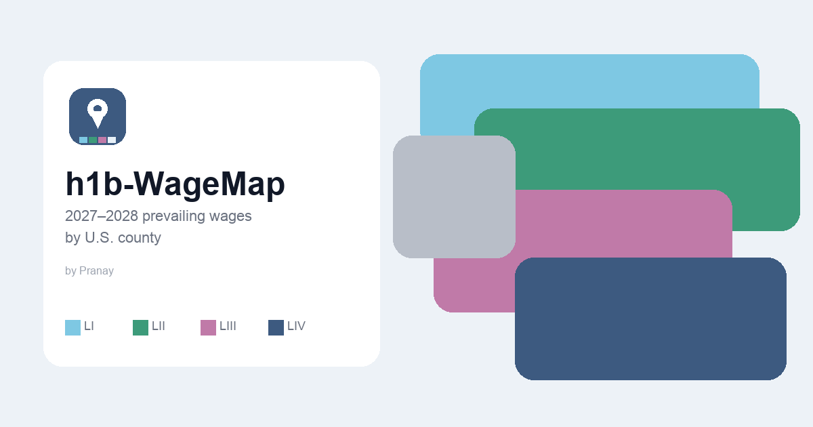

# h1b-WageMap

Interactive U.S. county map of **2027–2028 prevailing wages**, built by **[Pranay Mandadapu](https://github.com/sunnypranay)**. Search an occupation, enter a salary, and see which OFLC wage level (I–IV) applies in each county. Optionally overlay estimated H-1B lottery chances.

[](preview.png)

## Features

- Occupation search (any part of a title or SOC, default **15-1252.00 – Software Developers**)
- Annual salary → county colors for Levels I–IV, below Level I, and no data
- Full state names, full dollar amounts, and hourly rates in the county popup
- Optional DHS-estimated H-1B wage-weighted lottery overlay (not official 2027–2028 rates)
- Shareable URL (state, county, SOC, salary, lottery toggle)
- Works on phones: collapsed panel, 16px inputs, tap-to-open help

## Quick start

Node 18+ and npm.

```bash
cd ~/Projects/wagemap
npm install
npm run dev
```

Open http://localhost:5173. No Mapbox token is required.

```bash
npm run build
npm run preview
```

## Using the map

1. Search an occupation (or keep Software Developers).
2. Enter annual base salary.
3. Tap a county — or pick a state/county to zoom.
4. Toggle H-1B lottery for estimated selection chances by wage level.
5. Share copies the current view as a link.

## Data

| What | Source |
| --- | --- |
| Wage levels I–IV | DOL OFLC Prevailing Wage **2026–27** ALC export + Geography |
| SOC titles | OFLC `oes_soc_occs.csv` + `xwalk_plus.csv` |
| County polygons | Census `cb_2023_us_county_5m` (includes Connecticut planning regions) |
| Basemap | OpenFreeMap Positron via MapLibre GL |
| Lottery % | DHS estimates for a wage-weighted H-1B lottery (I 15.29 / II 30.58 / III 45.87 / IV 61.16) |

Packed files live in `public/data/soc/<SOC>.json` (hourly cents aligned to `public/data/geoids.json`). Details and privacy notes: [`disclosures.md`](disclosures.md).

Rebuild from an OFLC zip:

```bash
# place ALC_Export.csv, Geography.csv, oes_soc_occs.csv, xwalk_plus.csv in raw/
python3 -m venv .venv
.venv/bin/pip install -r scripts/requirements.txt
.venv/bin/python scripts/process_oflc_wages.py
```

## Deploy (Vercel Hobby)

Static Vite app. Packed wages keep `public/` around **65 MB**, under the 100 MB upload cap.

1. Import `sunnypranay/h1b-WageMap` in Vercel. Framework: Vite. Output: `dist`.
2. After the `*.vercel.app` URL is live, add the domain in [Google Search Console](https://search.google.com/search-console) and request indexing for `/`.
3. Set `og:url` / canonical in `index.html` to that origin.

Hobby bandwidth is **shared** (100 GB/month) across every project on the account.

## Author

[Pranay Mandadapu](https://github.com/sunnypranay)

Wage data is published by the U.S. Department of Labor, OFLC. Census geography is from the U.S. Census Bureau. Lottery percentages are DHS estimates, not USCIS selection results.

## License

MIT — see [`LICENSE`](LICENSE).
